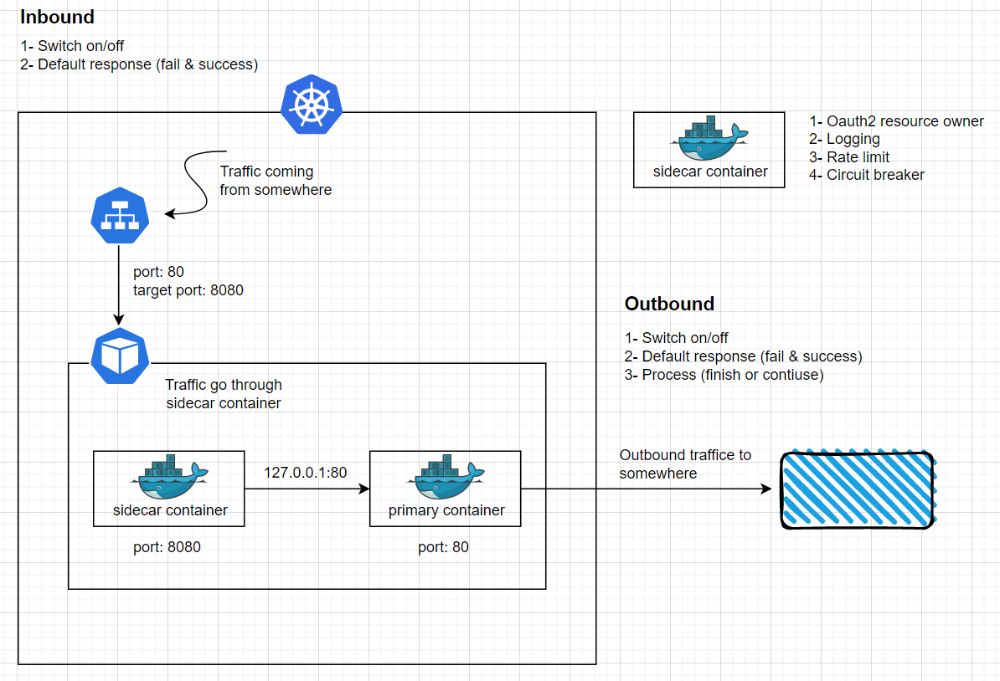

# Sidecar
<!-- PROJECT LOGO -->


#### 1. Environment variable
     
     |          Key         |                   Value                   |                         Desc                          |
     |:--------------------:|:-----------------------------------------:|:------------------------------------------------------|
     | SECURITY_CONFIG      | /opt/security-config.json                 | spring security resource owner config                 |
     | SERVICE_ID           | side-car                                  | service id                                            |
     | JWK_SET_URI          | https://localhost:9443/oauth2/jwks        | jwt token validation uri                              |
     | INTROSPECT_TOKEN_URI | https://localhost:9443/oauth2/introspect  | opaque token instrospection uri                       |
     | CLIENT_ID            | admin                                     | client id use for do token introspection              |
     | CLIENT_SECRET        | admin                                     | client secret use for do token introspection          |
     | ROLE_CLAIM           | roles                                     | role name claim from access token                     |
     | SERVICE_CLAIM        | services                                  | service name claim from access token                  |
     | ENABLE_LOG           | true or false                             | enable logging filter request and response            |
     | INBOUND_LOG          | true or false                             | enable http in coming log request and response        |
     | OUTBOUND_LOG         | true or false                             | enable http out going log request and response        |
     | PC-SCHEMA            | http or https                             | primary container protocal                            |
     | PC-HOST              | localhost or ip address                   | primary container host                                |
     | PC-PORT              | 80                                        | primary container port                                |
     | LIMIT-FOR-PERIOD     | 50                                        | number of allowed requests (RL)                       |
     | LIMIT-REFRESH-PERIOD | 500                                       | duration after which will be reset (RL)               |
     | TIMEOUT-DURATION     | 5                                         | maximum to permit subsequent requests (RL)            |
     | SLIDING-WINDOW-SIZE  | 10                                        | track the success and failure rates of calls (CB)     |
     | MINIMUM-NUMBER-CALL  | 5                                         | minimum calculate the success or failure rate (CB)    |
     | HALF-OPEN-NUMBER     | 3                                         | number of calls in half open state (CB)               |
     | FAILURE-THRESHOLD    | 50                                        | number of failure rate threshold (CB)                 |
     | CONSUMER-BUFFER-SIZE | 10                                        | number of event consumer buffer size (CB)             |
     
     
 #### 2. Security resource owner config
 
 There will be access denied all by default if you didn't provide <b>security-config.json</b>,
 so you can config it by using environment variable <b>SECURITY_CONFIG</b>
 
 ```shell script
SECURITY_CONFIG = /tmp/config/sample.json
```

 ##### Sample config
 ```javascript
[
  {
    "order": -1,
    "authenticated": true/false,
    "permit_all": true/false,
    "deny_all": true/false,
    "methods": [],
    "endpoints": [
      "/api/v3/customer"
    ],
    "roles": [
      "ADMIN"
    ]
  },
  {
    "order": 1,
    "authenticated": true/false,
    "permit_all": true/false,
    "deny_all": true/false,
    "methods": [
      "PUT"
    ],
    "endpoints": [
      "/api/v3/customer"
    ],
    "roles": [
      "ADMIN"
    ]
  }
]
 ```